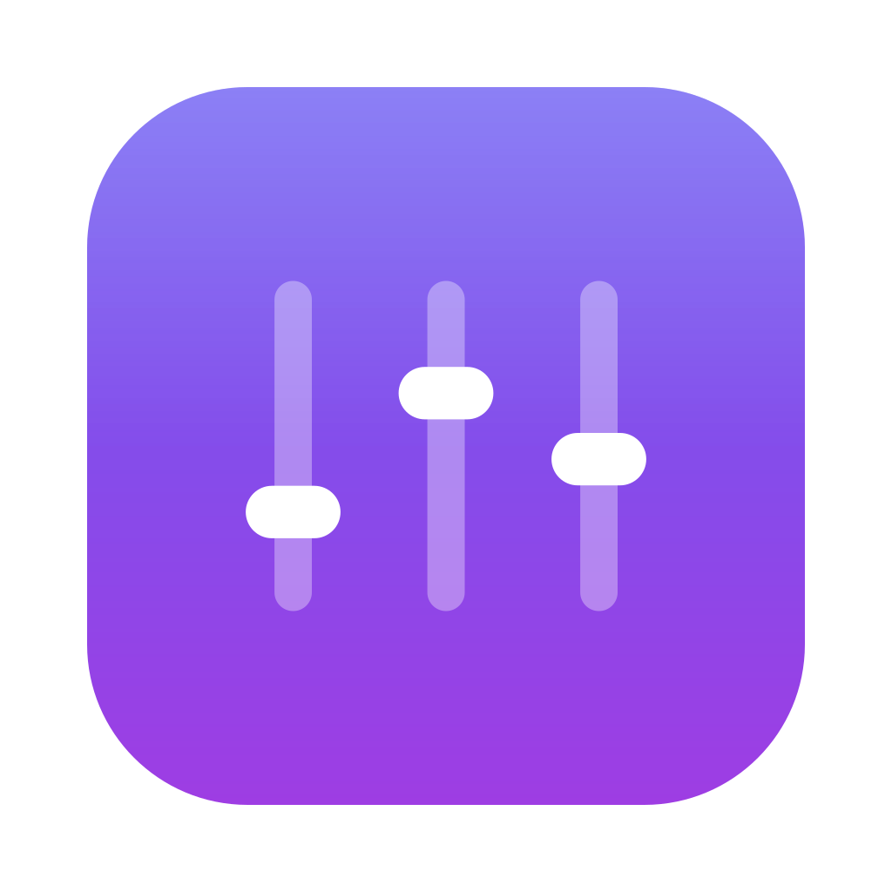

# MixBar brand

The whole identity comes from one idea: **a mixing desk that lives in the menu
bar.** Three faders, one plate, two colours. Everything below is downstream of
that, and nothing here should get more complicated than it.

## Mark

Three faders on a gradient plate. The knob positions (0.30, 0.66, 0.46 of their
track) are deliberately uneven — a mixer mid-adjustment, not a decorative
pattern. Never level them.

`docs/brand/mark.svg` and the shipped `.icns` are generated from the **same
geometry**, documented in `tools/make-icon.swift`:

| Measure | Value |
| --- | --- |
| Plate inset | 9.8% of canvas |
| Corner radius | 22.37% of plate width (Apple's continuous-corner proportion) |
| Track height | 46% of plate height |
| Track width | 5.2% of plate width |
| Knob | 13.2% × 7.3% of plate |
| Fader spacing | 21.3% of plate width |

If you change one, change the other, and re-render both.

**Clear space:** keep a margin of one fader-spacing (21% of the mark's width) on
all sides. **Minimum size:** 16px — the geometry is proportional and was tuned
to survive it. Below that, don't shrink it, drop it.

**Don't:** recolour the plate, put the mark on a busy photo, add an outer
stroke, rotate it, squash the aspect, or set the faders level.

## Colour

The gradient is the brand. Used flat, MixBar looks like a system slider; that
was the exact failure the palette was written to avoid.

| Token | Hex | Role |
| --- | --- | --- |
| `--brand-indigo` | `#6B5CF2` | Gradient start, top of the plate |
| `--brand-violet` | `#9E3DE3` | Gradient end, bottom of the plate |
| `--ink` | `#14101F` | Primary text on light |
| `--muted` | `#6B6880` | Secondary text on light |
| `--surface` | `#FFFFFF` | Page background, light |
| `--surface-2` | `#F6F5FA` | Cards and wells, light |
| `--border` | `#E6E3F0` | Hairlines, light |

Dark mode is not an inversion — the plate colours stay exactly as they are, and
only the neutrals move:

| Token | Hex |
| --- | --- |
| `--ink` | `#EDEAF5` |
| `--muted` | `#9B96AD` |
| `--surface` | `#0C0A14` |
| `--surface-2` | `#17141F` |
| `--border` | `#262133` |

The canonical gradient runs **top to bottom** on the icon (lit from above, like
the system icons) and **left to right** in UI fills. Both live in
`app/Sources/MixBar/Adapters/UI/Brand.swift` as `Brand.fill` and
`Brand.verticalFill`; the app must never hard-code these values anywhere else.

Contrast: `--muted` on `--surface` clears 4.5:1 in both themes. White on the
gradient clears 4.5:1 at every point along it. Don't put `--brand-indigo` text
on `--surface-2` — it lands at 3.9:1 and fails.

## Type

| Where | Face | Why |
| --- | --- | --- |
| The app | SF Pro (system) | It is a Mac utility; it should look like one |
| The website | Inter | The closest free web face to SF, so the site and the app read as one product |
| Code | JetBrains Mono | Install commands and log paths |

Set display sizes tight (`-0.02em` to `-0.03em`) and body at normal tracking.
The wordmark is simply **MixBar** in Inter SemiBold — one word, capital M,
capital B, no space. Not "Mixbar", not "MIXBAR", not "Mix Bar".

## Voice

The README's existing register is the brand voice, and it is worth protecting:
plain, specific, and willing to say what the software does *not* do. It states
costs up front — the microphone permission, the things not built yet — because
an app that asks to read your audio earns trust by being unusually direct, not
by being reassuring.

Write "per-app volume for Mac", not "effortless audio control". No exclamation
marks. No "simply" or "just". Name the real mechanism; the people who install a
menu bar mixer are people who want to know.

## Assets

| File | Use |
| --- | --- |
| `docs/brand/mark.svg` | README, website, anywhere vector works |
| `docs/brand/mark-1024.png` | Raster fallback, social avatars |
| `site/public/og.png` | Link previews (1200×630) |
| `build/AppIcon.icns` | Generated at build time, never committed |

Regenerate the raster assets with `swift tools/make-icon.swift --brand`.
